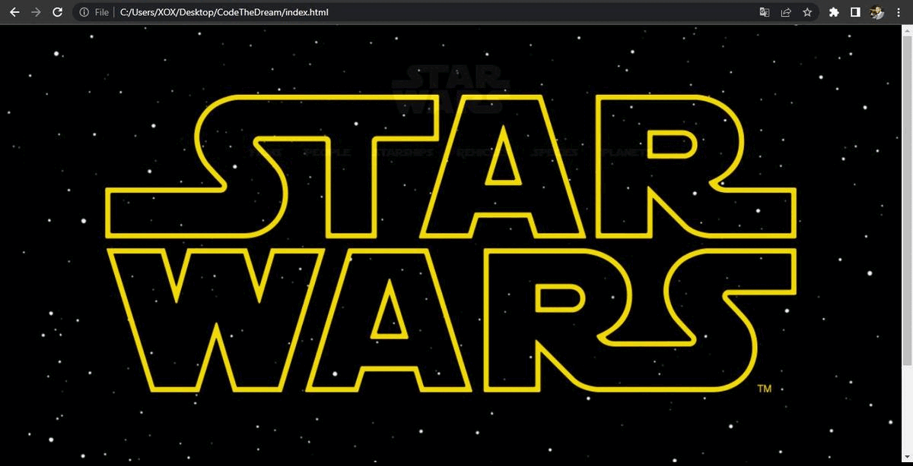

# CodeTheDream
CTD-CodeTheDream-PreWork

Demo project for Code the Dream
https://codethedream.org/pre-work-for-advanced-classes/

API: Star Wars API - SWAPI https://swapi.dev/
vanilla JavaScript, HTML, CSS

The website shows all Sar Wars:
- Characters
- Films
- Starships
- Vehicles
- Spices
- Planets

You can click on any item to show more details like:
- Click on a Character to show Films
- Click on a Film to show Characters

I added an overlay loading screen that appears while fetching data.

